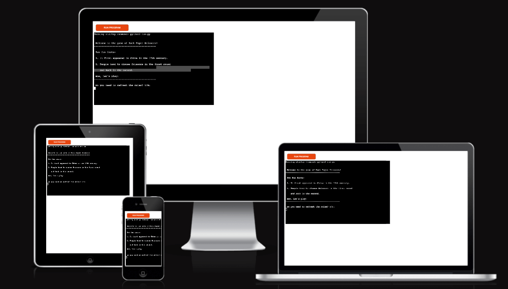
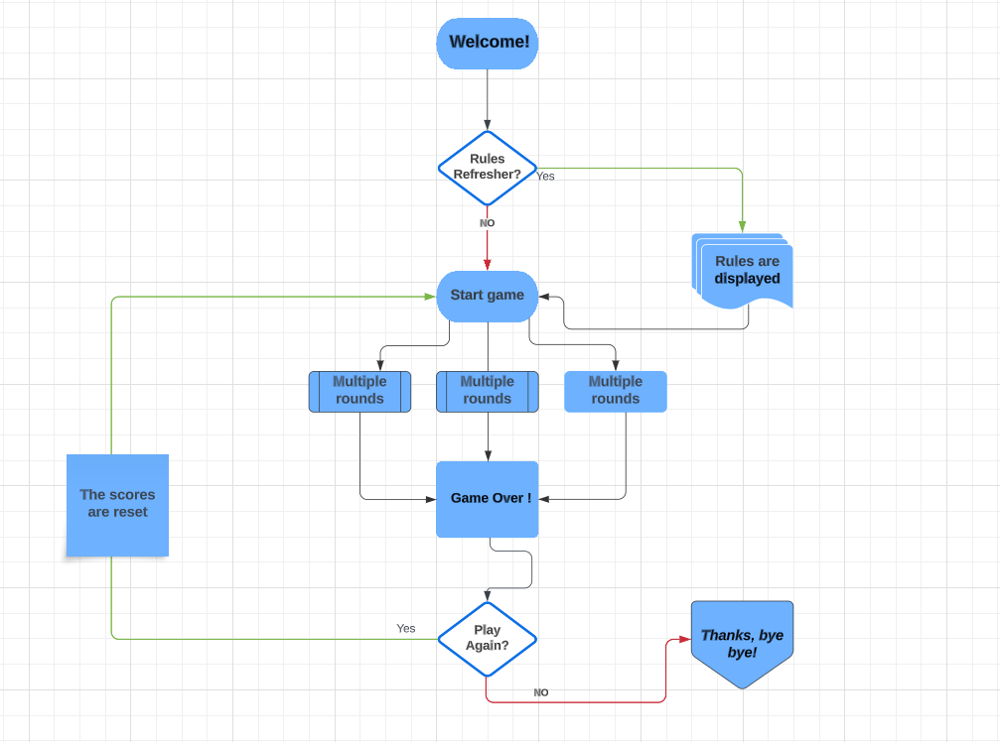
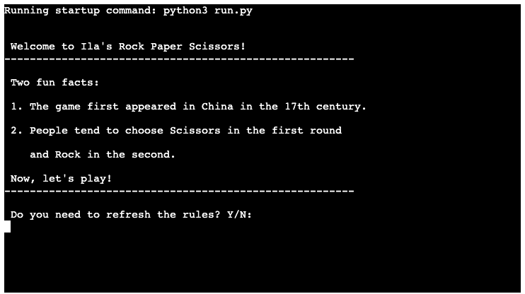
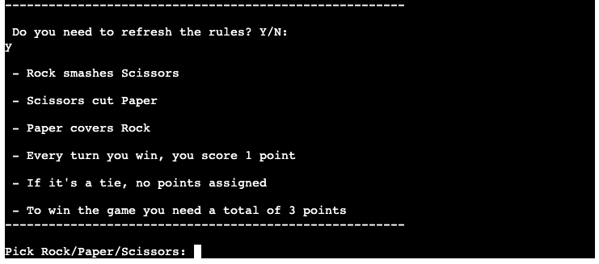
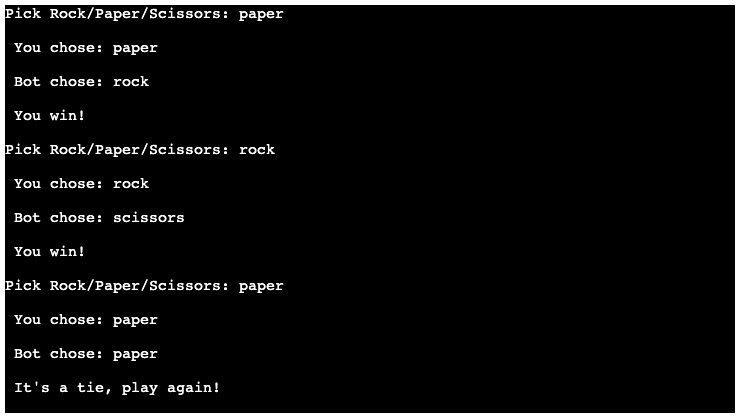
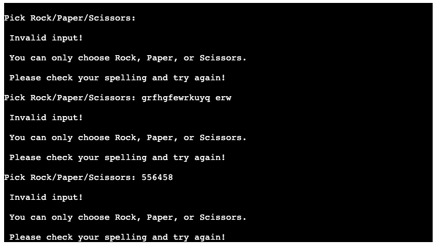
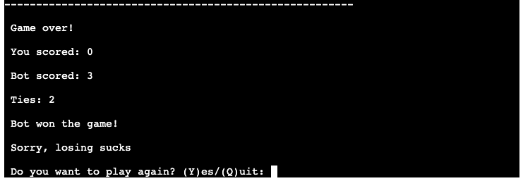
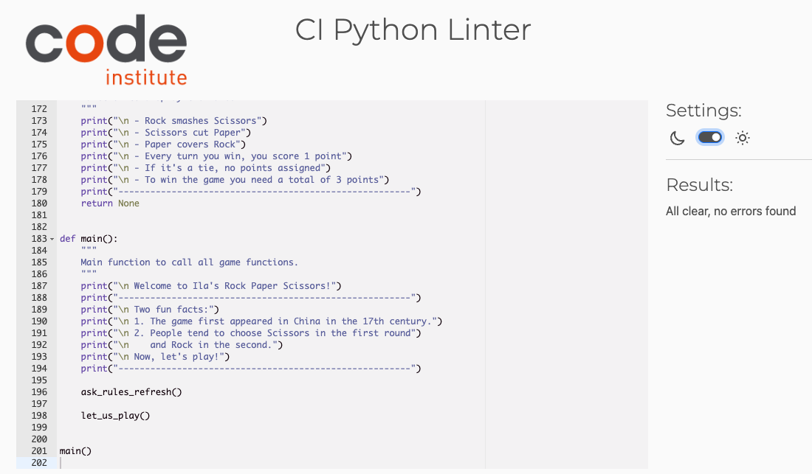

# Ila's Rock Paper Scissors
Ila's Rock Paper Scissors is an app that allows users to play this old-fashioned game against the computer.  

The game consists of multiple rounds: for each round, the user is prompted to type one of the possible options (rock, paper or scissors) then the computer will pick a random choice itself. 

There are three possible outcomes for each round: the user wins, the computer wins or it is a tie. For every win, one point is assigned. Ties do not count towards scoring. The first player to score 3 points wins the game. 

Once the game is over and the results are displayed, the user is presented with the option to run the app again, or quit the application. If they decide to play again, the scores will be reset and the game will restart.

Although the app is a terminal-based game and was designed to be accessed on desktop only, here is how it would look like on a variety of devices:

Ila's Rock Paper Scissors site is live, the link can be found [HERE](https://rock-paper-scissors-by-ila-72f68cf0d429.herokuapp.com/)

## Table of Contents
+ [UX](#ux "UX")
  + [Site Purpose](#site-purpose "Site Purpose")
  + [Site Goal](#site-goal "Site Goal")
  + [Audience](#audience "Audience")
  + [Communication](#communication "Communication")
  + [Current User Goals](#current-user-goals "Current User Goals")
  + [New User Goals](#new-user-goals "New User Goals")
  + [Future Goals](#future-goals "Future Goals")
+ [Design](#design "Design")
   + [Wireframes](#wireframes "Wireframes")
+ [Features](#features "Features")
  + [Existing Features](#existing-features "Existing Features")
    + [Landing Page](#landing-page "Landing Page")
    + [Rules Refresher](#rules-refresher "Rules Refresher")
    + [Possible Outcomes](#possible-outcomes "Possible Outcomes")
    + [Error Handling](#error-handling "Error Handling")
    + [Final Scores](#final-scores "Final Scores")
    + [Play Again or Quit App](#play-again-or-quit-app "Play Again or Quit App")
  + [Features Left to Implement](#features-left-to-implement "Features Left to Implement")
+ [Testing](#testing "Testing")
  + [Validator Testing](#validator-testing "Validator Testing")
  + [Manual Testing](#manual-testing "Manual Testing")
  + [Bugs](#bugs "Bugs")
  + [Unfixed Bugs](#unfixed-bugs "Unfixed Bugs")
+ [Technologies Used](#technologies-used "Technologies Used")
  + [Main Language](#main-language "Main Language")
  + [Frameworks, Libraries & Programs](#frameworks-libraries-programs "Frameworks, Libraries & Programs")
+ [Deployment](#deployment "Deployment")
    - [1 - Version Control](#version-control "Version Control")
    - [2 - Page Deployment](#page-deployment "Page Deployment")
+ [Credits](#credits "Credits")
  + [Content](#content "Content")
  + [Acknowledgements](#acknowledgements "Acknowledgements")

## UX

### Site Purpose:
To allow users to challenge the computer playing the Rock Paper Scissors game.

### Site Goal: 
To provide a simple and fun platform to try their luck and have fun in anticipating the computer's random choice.

### Audience:
Anyone passionate about computer games based on luck.

### Communication:
The app aims to provide light-hearted entertainment. The print statements generated are clear and to the point, prompting the user to choose their options at each turn and prevent errors by communicating clearly if the input is incorrect. 

### Current User Goals:
To keep the user entertained and engaged with the app by allowing them to play multiple games, one after the other. 

### New User Goals:
Experiment with a computer-based version of the old-fashioned game.

### Future Goals:
Make the game more challenging by providing more options to choose from and a leaderboard to encourage users to keep playing. Improve text readability by adding a touch of colour to the print statements.

## Design

### Wireframes:

## Features

### Existing Features:

#### Landing Page:

The user is greeted with a couple of fun facts regarding the original game of Rock Paper Scissors. The user is then able to choose whether to revise the rules of the game or go straight to playing.
The only viable options to choose from (Y or N) are clearly stated. If the user types any other keys or clicks enter without typing anything, an error message is displayed with the only available options. A loop makes sure that the user has the chance to type their answer again, until they type an acceptable option. 

#### Rules Refresher:

A quick summary of the main rules of the game, how points are assigned and how many are needed to win the game. In the subsequent line, the user can start playing by entering one of the possible options.

#### Possible Outcomes:

For each round the user and the computer's choices are displayed, as well as the partial results. If it is a tie, the user is prompted to make another choice.

#### Error Handling:

The only viable options to choose from while playing are Rock, Paper, Scissors. The input can be typed in both uppercase and lowercase and still treated as valid.
If the user types any other keys or clicks enter without typing anything, an error message is displayed reminding them of the only three available options. A loop makes sure that the user has the chance to type their choice again, until they type an acceptable option.

#### Final Scores:

As soon as either the user or the computer score 3 points, the end of the game is announced together with the final results, including the number of ties.

#### Play Again or Quit App:

The user has the option to quit the app or keep playing. In the latter case, the game restarts and the scores are reset.

### Features Left to Implement
- Expand the app and provide more options to choose from (Lizard, Spock).
- Change the colour of the print statements to improve text readability in the terminal. 
- Keep track of the scores for each gaming session and create a leaderboard to store the best scores.

## Testing

### Validator Testing
- The code has been tested by using [CI PEP8 Online](https://pep8ci.herokuapp.com/). 
The only error originally found was a blank line left at end of the file. This error has been fixed.

### Manual Testing
| Test            | Expected            | Outcome     |
| :-------------- | :------------------ | :---------- |
|   Open landing page             |   A series of print statements are displayed, greeting the user and providing fun facts about the game. In the last line the user is asked if they wish to revise the rules before playing.                  | As Expected |
|  Terminal: Do you need to refresh the rules? Y/N: 
Click enter without typing anything             | An error message is displayed warning the user about the invalid input and reminding them of the two possible options. In the last line the user is asked again if they wish to revise the game before playing.              | As Expected |
|   Terminal: Do you need to refresh the rules? Y/N:
Type a number or a series of numbers             | An error message is displayed warning the user about the invalid input and reminding them of the two possible options. In the last line the user is asked again if they wish to revise the game before playing.              | As Expected |
|   Terminal: Do you need to refresh the rules? Y/N:
Type random keys          | An error message is displayed warning the user about the invalid input and reminding them of the two possible options. In the last line the user is asked again if they wish to revise the game before playing.              | As Expected |
|   Terminal: Do you need to refresh the rules? Y/N:
Type y in lowercase             |    The rules of the game are displayed. The final line prompts the user to start playing by typing an option between Rock, Paper and Scissors.                 | As Expected |
|   Terminal: Do you need to refresh the rules? Y/N:
Type Y in uppercase             |  The rules of the game are displayed. The final line prompts the user to start playing by typing an option between Rock, Paper and Scissors.                   | As Expected |
|   Terminal: Do you need to refresh the rules? Y/N:
Type n in lowercase             |   The rules of the game are displayed. The final line prompts the user to start playing by typing an option between Rock, Paper and Scissors.                  | As Expected |
|    Terminal: Do you need to refresh the rules? Y/N:
Type N in uppercase            |   The rules of the game are displayed. The final line prompts the user to start playing by typing an option between Rock, Paper and Scissors.                  | As Expected |
|   Terminal: Pick Rock/Paper/Scissors: 
Type rock in lowercase / Type paper in lowercase / Type scissors in lowercase            |  The input is validated by the system which shows the user's choice, a random computer's choice and establish the winner of the round. The last line prompts the user to pick Rock, Paper or Scissors.                  | As Expected |
|   Terminal: Pick Rock/Paper/Scissors: 
Type rock in uppercase 
Type paper in uppercase 
Type scissors in uppercase          |  The input is validated by the system which shows the user's choice, a random computer's choice and establish the winner of the round. The last line prompts the user to pick Rock, Paper or Scissors.                  | As Expected |
|   Terminal: Pick Rock/Paper/Scissors:
Type a random combination of lowercase and uppercase letters, such as RoCk, pApeR or scISsORs.          |  The input is validated by the system which shows the user's choice, a random computer's choice and establish the winner of the round. The last line prompts the user to pick Rock, Paper or Scissors.                  | As Expected |
|   Keep playing until either opponent scores a total of three points.         |  The game is over, the final scores are displayed and the winner is announced. The last line asks the user if they want play again. Two options are displayed: Y to answer Yes and Q to quit the application.            | As Expected |
|   Terminal: Do you want to play again? (Y)es/(Q)uit:
Type y in lowercase        |  A message wishes the user best of luck. On a second line the user is prompted to start playing by typing an option between Rock, Paper and Scissors.                           | As Expected |
|   Terminal: Do you want to play again? (Y)es/(Q)uit:
Type Y in uppercase        |  A message wishes the user best of luck. On a second line the user is prompted to start playing by typing an option between Rock, Paper and Scissors.                           | As Expected |
|   Terminal: Do you want to play again? (Y)es/(Q)uit:
Type any of the following options: yes / YES / YeS / YEs / yeS / YEs / Yes / yES       | An error message is displayed warning the user about the invalid input and reminding them what the two possible options are. In a subsequent line the user is asked if they wish to play the game again.              | As Expected |
|   Terminal: Do you want to play again? (Y)es/(Q)uit:
Click enter without typing anything             | An error message is displayed warning the user about the invalid input and reminding them of the two possible options. In a subsequent line the user is asked if they wish to play the game again.              | As Expected |
|   Terminal: Do you want to play again? (Y)es/(Q)uit:
Type a number or a series of numbers             | An error message is displayed warning the user about the invalid input and reminding them of the two possible options. In a subsequent line the user is asked if they wish to play the game again.             | As Expected |
|   Terminal: Do you want to play again? (Y)es/(Q)uit:
Type random keys          | An error message is displayed warning the user about the invalid input and reminding them of the two possible options. In a subsequent line the user is asked if they wish to play the game again.               | As Expected |
|   Terminal: Here you go, best of luck! Pick Rock/Paper/Scissors:
Play the game until a winner is declared. | The scores from the previous game were correctly reset and the score of the winner of the current game shows exactly 3 points (no more than 3) | As Expected |
|   Terminal: Do you want to play again? (Y)es/(Q)uit:
Type q in lowercase          | A goodbye message is displayed thanking the user for playing.             | As Expected |
|   Terminal: Do you want to play again? (Y)es/(Q)uit:
Type Q in uppercase          | A goodbye message is displayed thanking the user for playing.             | As Expected |
|   Click on Run Program          | The previous messages are cleared and the landing page is displayed.            | As Expected |

### Bugs
- At the onset of the project, my very first approach was to include multiple functionalities inside the same function. My CI mentor Martina suggested that I break down the structure of the code into smaller and more manageable functions, so that the code would be easier to read, test and maintain. I implemented the feedback by creating separate functions for displaying the rules, getting the user input, establishing the winner, and playing again. 
- At one point, when testing the scenrio where the user decided to play another game, the system kept adding points to the scores of the previous game, instead of resetting the count. I solved this by creating a function to reset the scores, before starting a new game.
- Through testing, I realized the game kept playing in a loop, even when the user decided to exit the game. I researched a possible solution and solved it by importing "sys" and adding "sys.exit()". The instructions to implement this specific piece of code were sourced from [StackOverflow](https://stackoverflow.com/questions/14639077/how-to-use-sys-exit-in-python).
- At the beginning I had not envisaged a proper error handling for incorrect input. I included one instance of exception handling to display error messages to the user and recommend the correct options to input.

### Unfixed Bugs
None that I am aware of as of now.

## Technologies Used
### Main Language Used
- Python

### Frameworks, Libraries & Programs Used
- Gitpod and Codeanywhere - used as the coding environment.
- GitHub - to store the repository for submission.
- Lucid - to create the mock up in preparation for the project.
- Heroku - to deploy the live version of the terminal
- Random - to randomize the choices of the computer player.

## Deployment
### Version Control
The version control was maintained using git within GitPod and CodeAnywhere to push code to the main repository.

 * From the Gitpod terminal type "git add .", to make changes and/or updates to the files.

 * Type "git commit -m (insert a short descriptive text)", which commits the changes and updates the files.

 * Use the "git push" command, which pushes the committed changes to the main repository. 
 
 * To go back and forth between Gitpod and CodeAnywhere workspaces, use the command "git pull" to make sure all data has been brought over before working from the new space.

 ### Page Deployment

The app was deployed to Heroku CLI. The steps to deploy are as follows:

 * After creating an account and logging in, click "New" to create a new app from the dashboard.

 * Choose a unique name for the app and select relevant region; press "Create app".

 * Go to "Settings" and navigate to Config Vars.

 * Add Config Vars. 
 For this app only one was used: KEY = PORT : VALUE = 8000.
 
 * Add buildpacks Python and NodeJS - in this order.
 
 * Click the Deploy tab.
 
 * Scroll Down to Deployment Method and select GitHub.
 
 * Select repository to be deployed and connect to Heroku.
 
 * Scroll down to deploy: 
    * Option 1 is selecting Automatic deploys (Will Update Automatically with every "git push"). This is what was chosen for this project.
    * Option 2 is selecting Manual deploy (Needs to be manually redeployed after every change, via Heroku deploy tab).

 Visit the live deployment [HERE - Ila's Rock Paper Scissors](https://rock-paper-scissors-by-ila-72f68cf0d429.herokuapp.com/)

## Credits
As an initial inspiration, I watched the following YouTube tutorials by:
- [Kylie Ying](https://www.youtube.com/watch?v=8ext9G7xspg&t=2189s)
- [Shaun Halverson](https://www.youtube.com/watch?v=LumFgJxRjP4)

To understand and implement the logic required for the game, I consulted the following articles by:
- [Chris Wilkerson](https://realpython.com/python-rock-paper-scissors/#what-is-rock-paper-scissors)
- [Teri Eyenike](https://hackernoon.com/how-to-build-a-rock-paper-scissors-game-in-python)

The following pages were consulted throughout the coding process:
+ [StackOverflow](https://stackoverflow.com/questions/14639077/how-to-use-sys-exit-in-python) - sourced for the exit function.
+ [W3Schools Python Random randint](https://www.w3schools.com/python/ref_random_randint.asp) - to learn how to import the random system.
+ [W3Schools Conditions and If statements](https://www.w3schools.com/python/python_conditions.asp) - as a reference point. 
+ [W3Schools While loops](https://www.w3schools.com/python/python_while_loops.asp) - as a reference point.

The deployment of the game was learned from Code Institute's walkthrough project: love_sandwiches

### Acknowledgements
A special acknowledgement goes to [Martina Terlevic](https://github.com/SephTheOverwitch), my Code Institute Mentor, for her invaluable professional advice, unwavering support and encouragement.